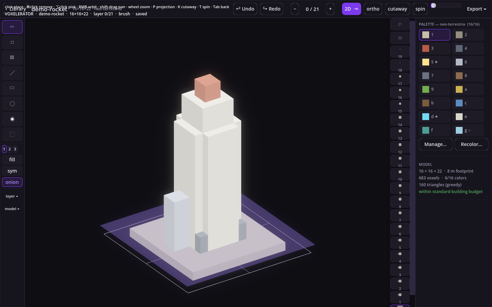
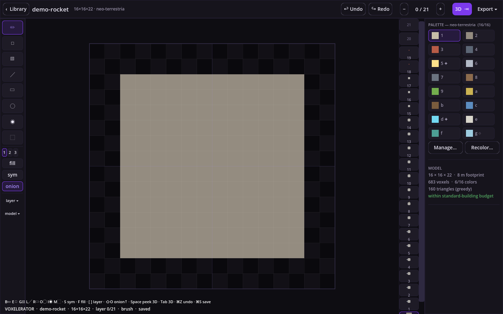

# Voxelerator

**A palette-constrained voxel editor whose native format is a stack of PNGs** — one image
per horizontal layer, one pixel per voxel. Draw slices top-down like pixel art, flip to a
3D voxel view (orthographic or perspective) to check the shape, and export a folder your
game meshes directly. LLMs are first-class co-artists via a built-in MCP server.




## The three laws

1. **The PNG stack IS the model.** No opaque binary format: every layer is an ordinary
   image any tool (or LLM, or git diff) can read. Export = copy. Import = drop a folder in.
2. **The palette is law.** A model binds to a named palette (≤ 16 colors) and the editor
   refuses colors outside it — cohesion by construction. Colors carry semantic tags:
   `emissive` (glows at night) and `glass` (renders translucent).
3. **Agent co-authoring is native.** The MCP server reads layers as text grids, edits
   voxels, and **renders the model back as an image** — the full see-it/fix-it loop.

## Quickstart

Requirements: [.NET SDK 8+](https://dotnet.microsoft.com) and
[Godot 4.6 (.NET edition)](https://godotengine.org) on your PATH as `godot`.

```sh
git clone https://github.com/radical-beard/voxelerator
cd voxelerator
godot --path app        # the editor
dotnet test core/Voxelerator.Core.Tests/Voxelerator.Core.Tests.csproj   # 70 tests
```

Register the MCP server in Claude Code:

```sh
claude mcp add voxelerator -- dotnet run --project <repo>/mcp/Voxelerator.Mcp -c Release
```

(or `dotnet publish mcp/Voxelerator.Mcp -c Release` once and point at the produced
`voxelerator-mcp` binary.)

## The format (the contract)

A model is a folder:

```
rocket/
  0001.png     ← layer 0, the ground slice (file number = layer index + 1)
  0002.png     ← layer 1 … stack grows bottom-up
  …
  model.json   ← manifest: format version, name, size, palette (embedded copy)
```

- Each PNG is **W×D pixels** for a model with H layers. Pixel **(px, py) → voxel
  (x = px, z = py)**; image top-left is (0,0); the layer index is y.
- **Alpha is binary**: 0 = air, 255 = filled. Anything else fails validation.
- The writer emits **8-bit indexed PNG** (PLTE = palette, tRNS for air) with **stored
  deflate blocks** — same model → byte-identical files, forever, on every platform.
  Models diff cleanly in git.
- The reader also accepts plain 8-bit RGB/RGBA PNGs (any scanline filter), so stacks
  drawn in other tools import — every opaque pixel must exactly match a palette color.
- Palettes: `{ "name": "...", "colors": [{ "hex": "#RRGGBB", "name": "wall",
  "tags": ["emissive"] }, …] }`, at most 16 colors, order = slot number = hotkey.
- Validation invariants (checked on open, save, import, and by the `validate` MCP tool):
  contiguous layer files, exact dimensions, binary alpha, every color ∈ palette,
  manifest agrees with the files.

World scale: one voxel = 0.5 m; 8 voxels = one 4 m Neo Terrestria build cell. Meshes
are centered on the footprint with ground at y = 0, +y up.

## Editor

| Where | Keys |
|---|---|
| Tools | `B` brush (RMB erases) · `E` eraser · `G` bucket · `L` line · `R` rect · `O` ellipse · `I` eyedrop (`⌥click` anywhere) · `M` select |
| Shapes & symmetry | `F` filled shapes · `S` cycle symmetry (X → Z → XZ → radial-4) |
| Layers | `[` `]` up/down · `Home`/`End` first/last non-empty · scrubber strip · `⇧O` onion above · layer ▾ menu: copy/paste/duplicate/insert/delete/swap/flip/rotate/extrude |
| Selection | drag marquee · drag inside to move · `⌘C` `⌘X` `⌘V` `⌘A` · arrows nudge (`⇧` = 8) · `Del` clears |
| 3D view | hold `Space` to peek · `Tab` sticky toggle · click place / `⌘click` remove / `⌥click` pick · RMB orbit · `⇧wheel` walks the layer plate · `P` ortho⇄perspective · `K` cutaway · `T` turntable · night slider lights emissive colors |
| Files | continuous autosave (+3 rotating backups) · `⌘S` save now · `⌘Z`/`⇧⌘Z` undo/redo · Export ▾: model folder, PNG screenshot, turntable GIF |

Models save **wherever you choose** — the app keeps only metadata under
`~/.local/share/voxelerator/` (recents registry, shared palettes, backups, thumbnails,
settings). If an MCP agent edits the folder you have open, the editor absorbs the change
as an undo step.

Built-in palettes: `neo-terrestria`, `neo-terrestria-decor` (seeded from the game's
color language), and `primer` (a neutral starter).

## MCP server

23 tools over stdio JSON-RPC — inspect (`list_models`, `model_info`, `get_layer(s)`,
`get_palette`, `validate`), edit (`set_layer`, `set_voxels`, `fill_box`, `hollow_box`,
`fill_cylinder`, `copy/insert/delete_layer`, `replace_color`, `mirror`), create
(`create_model`, `duplicate_model`, `create_palette`, `add_color`) and output
(`render` → PNG image content, `export_model`). There is deliberately **no
`delete_model`** — agents create and mutate; only humans destroy.

Layers travel as token-cheap text grids — rows are z, `.` = air, slots 1–16 as
`1…9a…g`:

```
...11...
..1221..
..1221..
...11...
```

Every mutating tool writes atomically, takes one rotating backup per model per session,
and the coordinate conventions are embedded in the tool descriptions, so a fresh agent
session needs no briefing.

## Consuming models in a game

The exported folder is engine-agnostic: read the PNGs bottom-up, map opaque pixels to
unit cubes, mesh however you like. For Godot + Neo Terrestria the natural seam is the
per-def mesh cache (`BuildingRenderer.MeshFor`): load the folder into a `VoxelModel`,
run the greedy mesher, and the sculpted building is simply replaced — construction
grow-shaders keep working because layer stacks are literally floors. Emissive/glass
tags map to the vertex-alpha convention the shaders already use.

## Repo layout

| Path | What |
|---|---|
| `core/Voxelerator.Core` | zero-dependency .NET 8 library: PNG codec, model, greedy mesher, edit ops, undo, registry, software renderer, GIF encoder |
| `core/Voxelerator.Core.Tests` | 70 xunit tests: round-trip, byte-determinism, validation, mesher, ops, MCP protocol |
| `mcp/Voxelerator.Mcp` | `voxelerator-mcp` — hand-rolled stdio MCP server (no SDK dependency) |
| `app/` | Godot 4.6 (C#) editor — UI built in code, EvaLuate-hosted status shell, dark-purple theme |

CI runs the test suite, AOT analyzers (`IsAotCompatible` + warnings-as-errors), and an
app compile on every push.
